# 1.1 Virtual DOM

## 前言

Vue 在 2.x 开始加入了 Virtual Dom (简称 VD)的概念，之前我们组的同学也在公众号发过一篇关于VD算法的思考[《如何实现一个 Virtual DOM 算法》](http://mp.weixin.qq.com/s/QXQAPEXojB9Zvri6GdXcJg)。

为什么要引入VD的概念，引用上述这篇文章简单来说就是：

> 页面经常要操作 JS 变量状态，同时操作对应的 DOM 元素，随着页面越来越复杂，我们需要维护 JS 各种变量状态，还有监听 DOM 各种事件，整个程序将越来越复杂。
>
> 既然状态改变了要操作相应的 DOM 元素，为什么不做一个东西可以让视图和状态进行绑定，状态变更了视图自动变更（维护状态、更新视图），就不用手动更新页面了。
>
> VD 就是让我们可以通过 JS 对象模拟 DOM 对象，在操作 JS 状态时，更新 VD 上的一些属性，最后再渲染出 VD 对应的 DOM 结构， 同时 VD 算法需要加了一些特别的步骤来避免了整棵 DOM 树变更。

在这个章节，我们从 Vue 的 VD 算法核心部分开始构造第一行代码！

## 1. 如何用 JS 对象表达一个 DOM 对象

为了让代码更简单更容易理解，我们暂时先忽略 DOM 元素的 attr 属性。

假如 DOM 结构如下所示：

```html
<ul>
  <li>Item 1</li>
  <li>Item 2</li>
  <li>Item 3</li>
</ul>
```

很容易就可以构造一个 VDom，在 Vue 里边称为 VNode 类(在后续的描述中 VDom 和 VNode 概念是等价的)：

```javascript
// vnode.js
export default class VNode {
  constructor (
    tag,      // 标签名
    children, // 孩子 [VNode, VNode]
    text      // 文本节点
  ) {
    this.tag = tag
    this.children = children
    this.text = text
  }
}
```
写个简单的工厂函数：

```javascript
import VNode from 'vnode'

// 创建非文本节点
var c = (tag, children) => {
  return VNode(tag, children,'')
}

// 创建文本节点
var t = (text) => {
  return VNode(null, [], text)
}
```

然后那上边的 DOM 结构就可以表达成：

```javascript
var ul =
    c('ul', [
      c('li', [ t("Item 1") ]),
      c('li', [ t("Item 2") ]),
      c('li', [ t("Item 3") ])
    ])
```

## 2. 把 VNode 对象渲染到 DOM 树上

如下图，我们应该怎么把下图从VNode的树结构真正渲染到parentElm底下呢？

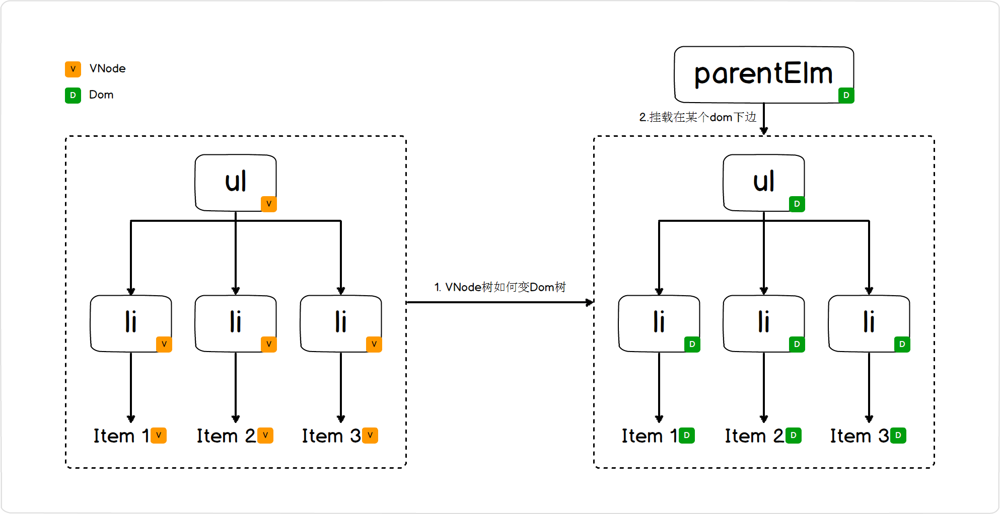

*【图：VNode树渲染成Dom树】*

基本的思路是这样的：

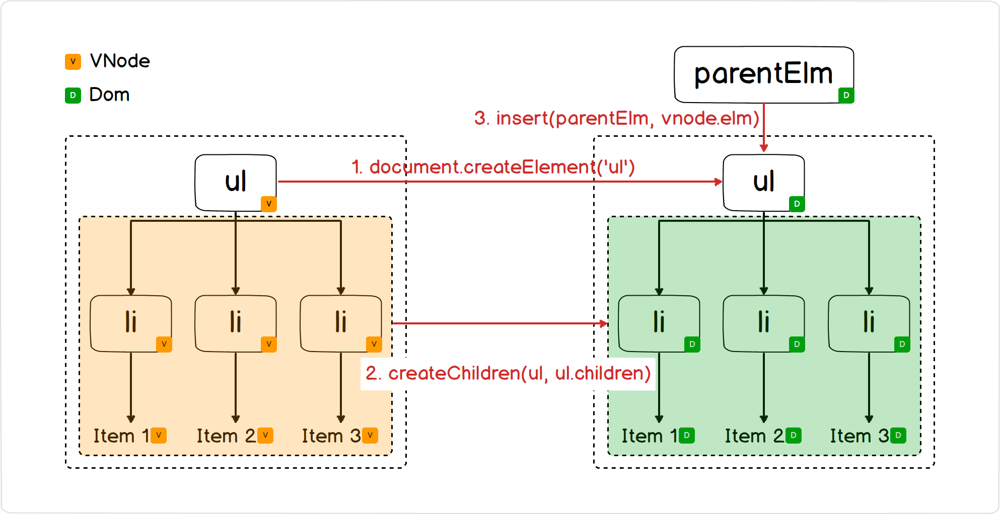

*【图：VNode树渲染成Dom树流程】*

用代码描述就是这样的：

1. 通过 ```createElm``` 当前 VNode 节点渲染到对应的 DOM 树上

```javascript
// patch.js
function createElm (vnode, parentElm, refElm) {
  const children = vnode.children
  const tag = vnode.tag

  if (tag) { // 非文本节点
    // 1. 先创建当前节点
    vnode.elm = document.createElement(tag)
    // 2. 创建孩子节点
    createChildren(vnode, children)
    // 3. 把当前节点插入到 DOM 上
    insert(parentElm, vnode.elm, refElm)
  } else {
    // 文本节点
    vnode.elm = document.createTextNode(vnode.text)
    insert(parentElm, vnode.elm, refElm)
  }
}
```

2. ```createChildren```递归创建当前 VNode 节点的孩子节点：

```javascript
function createChildren (vnode, children) {
  for (let i = 0; i < children.length; ++i) {
    createElm(children[i], vnode.elm, null)
  }
}
```

3. 通过 ```insert``` 函数，可以把一个 elm dom 对象，插入到 parent dom 上

```javascript
function insert (parent, elm, ref) {
  if (parent) {
    if (ref) {
      document.insertBefore(parent, elm, ref)
    } else {
      document.appendChild(parent, elm)
    }
  }
}
```

---------------------

所以前边我们构造的 ul 的VNode对象就可以通过以下方式渲染到 id="container" 的节点里边：

```javascript
createElm(
    ul,   // VNode
    document.getElementById("container"), // parentElm
    null  // refElm
)
```

## 3. VNode 更新如何更新到 DOM 树上

上一个状态的 VNode 对象我们命名为 oldVnode

这一次的状态 VNode 对象我们命名为 newVnode

### 3.1 patch

我们可以定义一个行为 patch 用于把 oldVnode 更新 newVnode

```javascript
// VNode 的更新作用到对应的 DOM 树上
patch (oldVnode, newVnode)
```
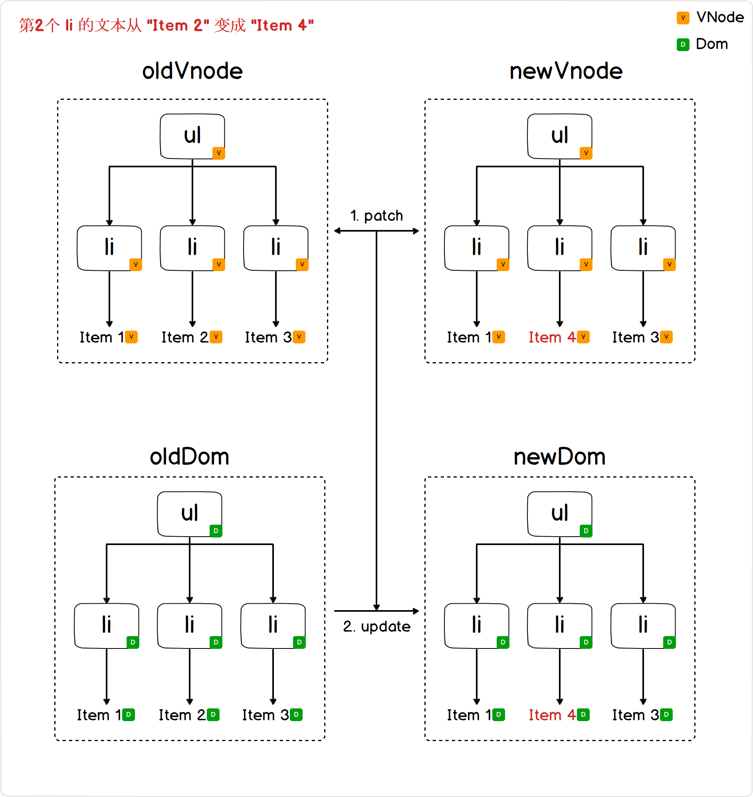

*【图：把 VNode 树的更新作用于 Dom 树上】*

接下来我们来阐述一下 VNode 各种状态的更新将如何更新对应 DOM 树

#### 3.1.1 oldVnode 和 newVnode 节点一致

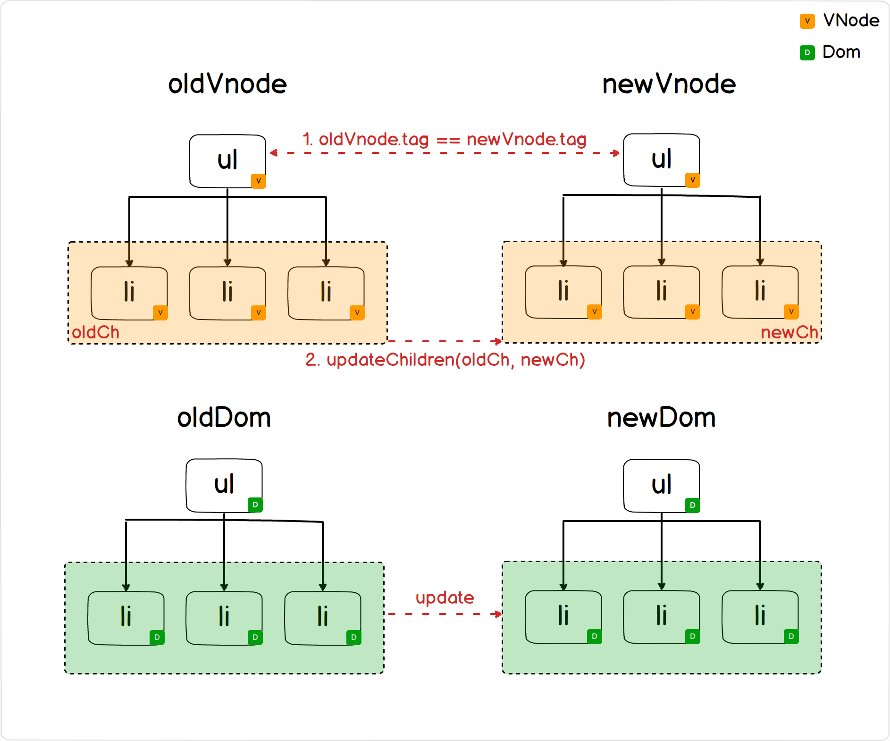

*【图  vnode 标签一致】*

使用 ```updateChildren``` 继续递归对比他们孩子节点 (我们在后边3.2节再讨论updateChildren)

```javascript
function patch (oldVnode, newVnode) {
  if (sameVnode(oldVnode, newVnode)) {
    // 如果两个 vnode 节点根一致
    updateChildren(oldVnode.children, newVnode.children)
  } else {
    // See 3.1.2
  }
```

#### 3.1.2 oldVnode 和 newVnode 节点不一致
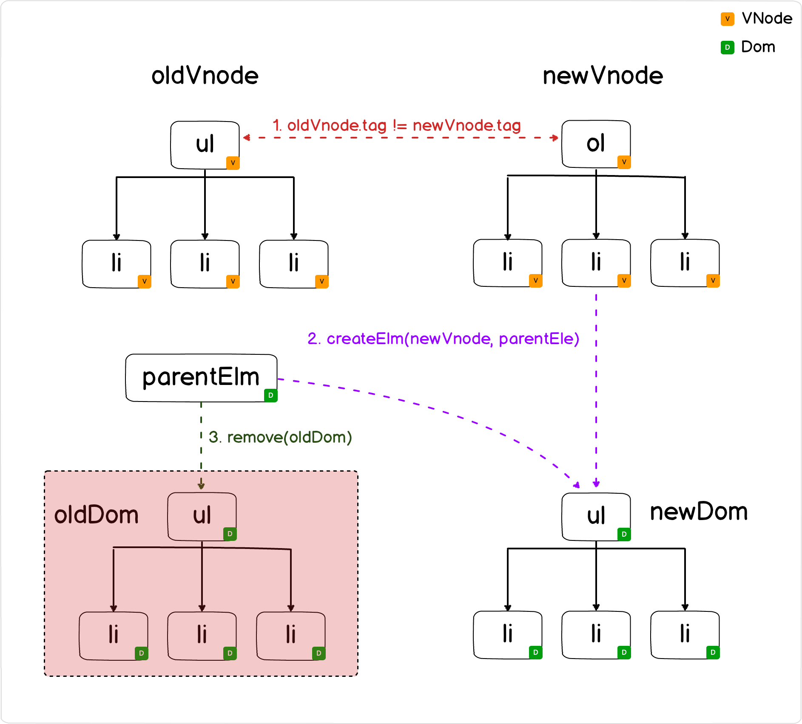

*【图 vnode标签不一致】*

1. 找到 oldVnode 对应的 DOM 节点及其父节点
2. 把当前的 newVnode 渲染在原来的父亲节点下
3. 把旧的 DOM 节点从原来的 DOM 树上移除

```javascript
function patch (oldVnode, newVnode) {
  if (sameVnode(oldVnode, newVnode)) {
    // See 3.1.1
  } else {
    // 1. 找到 oldVnode 对应的 DOM 节点及其父节点
    const oldElm = oldVnode.elm
    const parentElm = document.parentNode(oldElm)

    // 2. 把当前的 vnode 渲染在原来的父亲节点下
    createElm(
      newVnode,
      parentElm,
      document.nextSibling(oldElm)
    )

    // 3. 把旧的 DOM 节点从原来的 DOM 树上移除
    removeNode(oldVnode.elm)
  }
}
```

### 3.2 如何 diff 孩子节点 ```updateChildren```

刚刚3.1.1节提到，当两个节点标签一致的情况下，接下来就是对他们的孩子节点```oldCh```和```newCh```做对比.

为了简述方便，我们用字母 a, b, c 来表示 VNode 节点，我们用以下例子来阐述一下```updateChildren```的流程

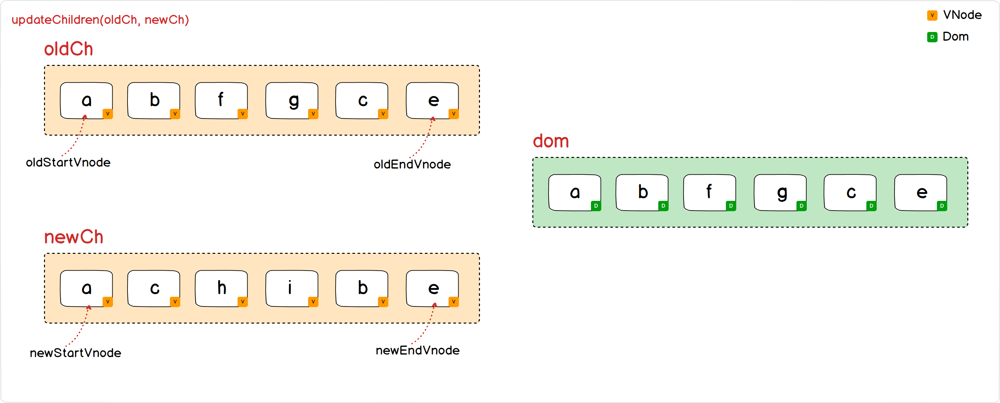

定义四个指针 ```oldStartVnode``` ```oldEndVnode``` ```newStartVnode``` ```newEndVnode```

1.  ```oldStartVnode``` 和 ```newStartVnode``` 相同

   递归 patch 2个节点，然后挪动2个指针位置

   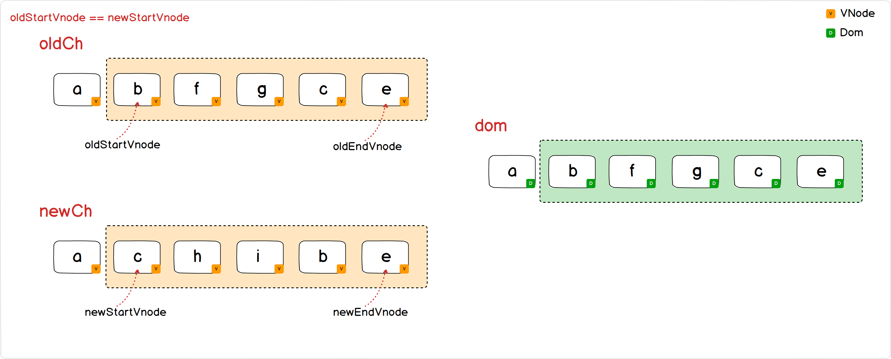

   ```javascript
   function updateChildren (parentElm, oldCh, newCh) {
     /* blabla */
     while (oldStartIdx <= oldEndIdx && newStartIdx <= newEndIdx) {
       if (/* blabla */) {
         /* blabla */
       } else if (sameVnode(oldStartVnode, newStartVnode)) {
         patchVnode(oldStartVnode, newStartVnode)
         oldStartVnode = oldCh[++oldStartIdx]
         newStartVnode = newCh[++newStartIdx]
       }
     }
   }
   ```

2.  ```oldEndVnode``` 和 ```newEndVnode``` 相同

   同上第1点

   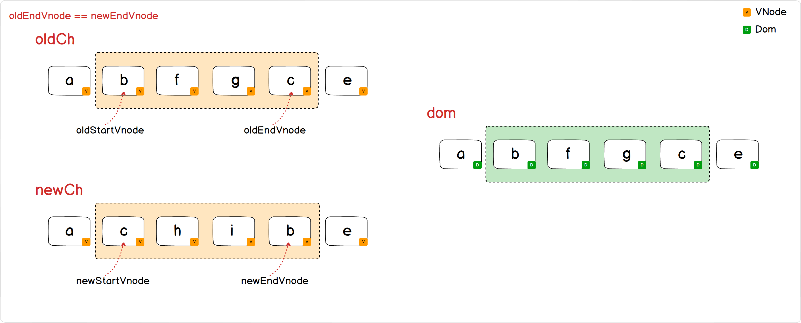

   ```javascript
   function updateChildren (parentElm, oldCh, newCh) {
     /* blabla */
     while (oldStartIdx <= oldEndIdx && newStartIdx <= newEndIdx) {
       if (/* blabla */) {
         /* blabla */
       } else if (sameVnode(oldEndVnode, newEndVnode)) {
         patchVnode(oldEndVnode, newEndVnode)
         oldEndVnode = oldCh[--oldEndIdx]
         newEndVnode = newCh[--newEndIdx]
       }
     }
   }
   ```

3.  ```oldStartVnode``` 和 ```newEndVnode``` 相同

   递归 patch 两个节点，同时把 oldStartDom 挪到 oldEndDom 之后

   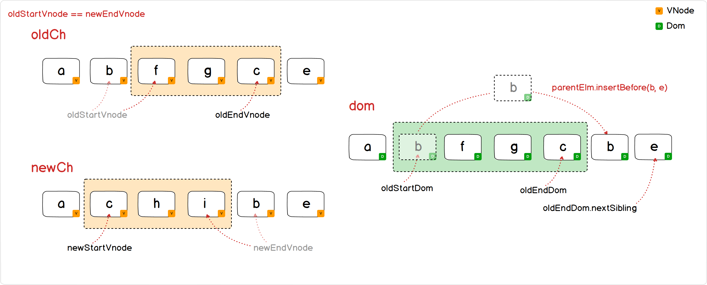

   ```javascript
   function updateChildren (parentElm, oldCh, newCh) {
     /* blabla */
     while (oldStartIdx <= oldEndIdx && newStartIdx <= newEndIdx) {
       if (/* blabla */) {
         /* blabla */
       } else if (sameVnode(oldStartVnode, newEndVnode)) {
         patchVnode(oldStartVnode, newEndVnode)
         parentElm.insertBefore(oldStartVnode.elm, oldEndVnode.elm.nextSibling)
         oldStartVnode = oldCh[++oldStartIdx]
         newEndVnode = newCh[--newEndIdx]
       }
     }
   }
   ```

4.  ```oldEndVnode``` 和 ```newStartVnode```相同

   递归 patch 两个节点，同时把 oldEndDom 挪到 oldStartDom 之前

   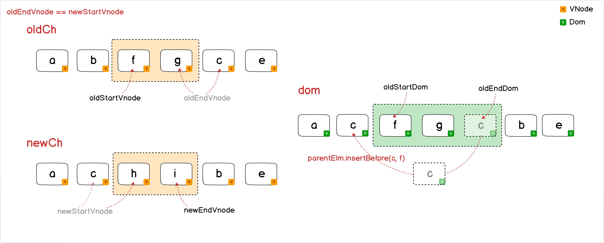

   ```javascript
   function updateChildren (parentElm, oldCh, newCh) {
     /* blabla */
     while (oldStartIdx <= oldEndIdx && newStartIdx <= newEndIdx) {
       if (/* blabla */) {
         /* blabla */
       } else if (sameVnode(oldEndVnode, newStartVnode)) {
         patchVnode(oldEndVnode, newStartVnode)
         parentElm.insertBefore(oldEndVnode.elm, oldStartVnode.elm)
         oldEndVnode = oldCh[--oldEndIdx]
         newStartVnode = newCh[++newStartIdx]
       }
     }
   }
   ```

5. 其他情况

   直接创建新的dom，插入到原来的父节点底下。

   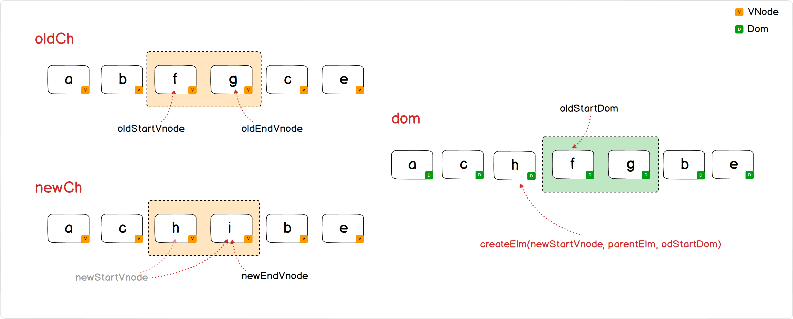

   ```javascript
   function updateChildren (parentElm, oldCh, newCh) {
     /* blabla */
     while (oldStartIdx <= oldEndIdx && newStartIdx <= newEndIdx) {
       if (/* blabla */) {
         /* blabla */
       } else {
         createElm(newStartVnode, parentElm, oldStartVnode.elm)
         newStartVnode = newCh[++newStartIdx]
       }
     }
   }
   ```


当循环结束之后，需要把 oldCh 和 newCh 还未处理的元素分别 从 dom 树 remove 掉 或者 add 进 dom 树。

我们可以想一下大多数涉及到列表操作的业务场景都是从列表里边删除某一项，或者从列表里边插入某一项。所以上述的```updateChildren```的算法效率还是很高的，时间复杂度 O(n) 就可以做完整个 VNode 树的更新了。

## 代码整理

前边的代码有一些边界问题没处理，同时组织一下目录结构，当前分支代码见：[https://github.com/raphealguo/how-to-learn-vue2/tree/1.1](https://github.com/raphealguo/how-to-learn-vue2/tree/1.1)


*【图】*


## 后续

大家应该从上边代码中看到一个问题，要手工构造一个 VNode 树要像下边这样逐层书写，开发起来效率低同时可读性很差。

```javascript
var ul =
    c('ul', [
      c('li', [ t("Item 1") ]),
      c('li', [ t("Item 2") ]),
      c('li', [ t("Item 3") ])
    ])
```
我们更希望编写 HTML 结构的字符串，通过一个 ```compile``` 函数把字符串编译成对应的 VNode 对象

```javascript
var html = `
    <ul>
      <li>Item 1</li>
      <li>Item 2</li>
      <li>Item 3</li>
    </ul>`

var ul = compile(html)
```
下一章节我们来尝试完成这么一个转换器。


