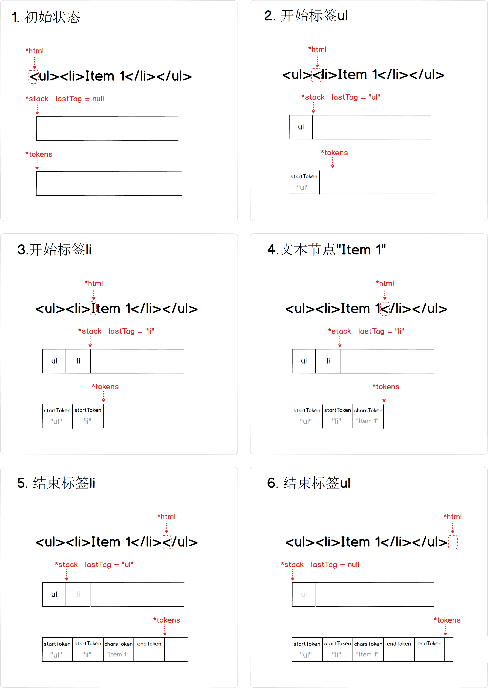
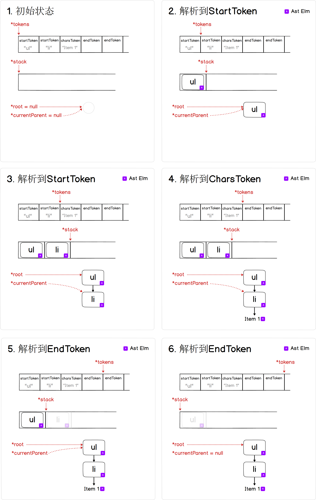

# 1.2 HTML parser

## 前言

在上一节 [1.1 Virtual Dom](./1.1.md) 说到，手工构造一个 VNode 树效率低，可读性也不好：

```javascript
var ul =
    c('ul', [
      c('li', [ t("Item 1") ]),
      c('li', [ t("Item 2") ]),
      c('li', [ t("Item 3") ])
    ])
```

我们更希望有一个 `compile` 函数把字符串编译成对应的 VNode 对象

```javascript
var html = 
    `<ul>
      <li>Item 1</li>
      <li>Item 2</li>
      <li>Item 3</li>
    </ul>`

var ul = compile(html)
```

## 1. 解析字符串 生成 HTMLElment Token流 

一个 HTML 字符串解析出来的 Token序列只需要以下三种 Token 就足够表达了: 

1. StartToken { tagName, attrs}	开始标签
2. EndToken { }                                  结束标签
3. CharsToken "text"                         文本节点

例如：

```javascript
html = `<ul id="a" class="b"><li class="c">Item 1</li></ul>`
```

以上的 HTML 字符串，解析之后的 Token 流：

 ```javascript
tokens = [ 
  StartToken { tagName: 'ul', attrs: [ {name:'id', value:'s'}, {name:'class', value:'b'}] },
  StartToken { tagName: 'li', attrs: [ {name:'class', value:'c'}] },
  CharsToken "Item 1",
  endToken,
  endToken,
]
 ```

我们先用示例图来表达整个解析过程。



```javascript
// html-parser.js
function parseHTML (html, options) {
  const stack = []
  let index = 0
  let lastTag

  while (html) {
    let textEnd = html.indexOf('<')
    if (textEnd === 0) {
      // 标签结束
      const endTagMatch = html.match(endTag) // endTagMatch = []

      if (endTagMatch) { // 把指针挪到 "</xxx>" 后边的位置
        const curIndex = index
        advance(endTagMatch[0].length)
        parseEndTag(endTagMatch[1], curIndex, index) // 处理一下堆栈信息，回调上层
        continue
      }

      // 标签起始：<xxx attr="xx">
      const startTagMatch = parseStartTag()
      if (startTagMatch) {
        handleStartTag(startTagMatch) 
        continue
      }
    }

    // 到这里就是处理文本节点了。
    let text, rest, next
    if (textEnd >= 0) {
      text = html.substring(0, textEnd)
      advance(textEnd)
    } else { // 之后的字符串不包含 '<' ，那剩余整个字符串都是文本节点了
      text = html
      html = ''
    }

    options.chars(text)
  }

  // advance(N) 负责把当前指向 html 字符串的指针往后挪动 N 个位置
  function advance (n) {
    index += n
    html = html.substring(n)
  }

  function parseStartTag () {
    // 忽略这里细节
    return { tagName, attrs, start, end, unarySlash }
  }

  function handleStartTag (match) {
    const tagName = match.tagName
    const unary = isUnaryTag(tagName)// 单标签
    const attrs = match.attrs

    if (!unary) { // 不是单标签的话 就压入堆栈
      stack.push({ tag: tagName, lowerCasedTag: tagName.toLowerCase(), attrs: attrs })
      lastTag = tagName
    }

    options.start(tagName, attrs, unary)
  }

  function parseEndTag (tagName, start, end) {
    // 堆栈弹出栈顶元素，记录上一个lastTag元素
    var pos = stack.length - 1
    options.end(stack[pos].tag, start, end)
    stack.length = pos
    lastTag = stack[pos - 1].tag
  }
}
```


## 2. 从 HTMLElment Token流 到 AST 树

拿到 tokens 序列之后，我们就可以构建对应的 AST 树。

AST 树节点的结构如下：

```javascript
// 非文本节点
tagAstElement = { type: 1, tag, attrsList, attrsMap, children, parent } 

// 文本节点
textAstElement = { type: 3, text } 
```

我们通过 ```parse```函数把字符串 template解析成一个AST树，最后返回这个树的根节点 root。（我们先忽略 StartToken 里边的 attrs）



定义三个回调 start, end, chars 分别处理 ```StartToken``` ```EndToken``` ```CharsToken```

```javascript
// compiler/index.js
function parse (template) {
  const stack = []
  let root // ast的根节点
  let currentParent // 当前节点的父亲节点

  parseHTML(template, {
    start (tag, unary) { // 
      const element = {
        type: 1,
        tag,
        parent: currentParent,
        children: []
      }
      if (!root) {
        root = element
      }
      if (currentParent) {
        currentParent.children.push(element)
      }
      if (!unary) { // 如果不是单标签，就压入堆栈
        currentParent = element
        stack.push(element)
      }
    },
    end () {
      stack.length -= 1
      currentParent = stack[stack.length - 1]
    },
    chars (text) {
      if (!currentParent) {
        return
      }
      const children = currentParent.children
      if (text) { // 文本节点
        children.push({
          type: 3,
          text
        })
      }
    }
  })
  return root
}
```

## 3. 从 AST 树到 VNode 树

把 AST 树转成 VNode 树还是比较简单的，我们采用 ```generate```来完成这个转换工作

```javascript
// compiler/codegen/index.js
export default function generate (ast) {
  return genElement(ast)
}

function genElement (el){
  let vnode = null

  if (el) {
    if (el.type == 1) { // 非文本节点
      vnode = new VNode(el.tag, genChildren(el), undefined, null)
    }else if (el.type == 3) { // 文本节点
      vnode = new VNode(null, [], el.text, null)
    }
  }
  return vnode
}

function genChildren (el) {
  const children = el.children
  const childrenVnode = []

  if (children.length) {
    children.forEach((c) =>{
      childrenVnode.push(genElement(c))
    })
  }
  return childrenVnode
}
```

## 总结: 从字符串到 DOM 树

首先有2个重要的概念要留意，将会贯穿后续的文章：**静态**、**动态(runtime)**。

我们给一下以下简单的定义：

1. 静态: 任何时刻运行转换函数，同一个输入得到的数据结构都是一致的
2. 动态: 存在某一时刻运行转换函数，同一个输入得到的数据结构是不一致的

所以上边所有涉及到的数据结构可以归为：

1. **字符串** 是 **静态** 的
2. **HTMLElment Token 流** 是 **静态** 的
3. **AST 树** 是 **静态** 的
4. **VNode 树** 是 **动态** 的
5. **DOM 树** 是 **动态** 的

我们重新把整个过程的数据结构转化梳理一下：


这一章节书写的 HTML Parser 把字符串解析出 HTMLElement Tokens这个环节在后续章节中无需改动，所以后续章节，我们将忽略这个数据结构转换流程。

而 VNode 树映射的 DOM 树也基本保持一致，所以后续的部分章节为了阐述方便也会忽略 DOM 树这个转换流程。

## 代码整理

当前分支新增的 shared 目录放置公共辅助函数，其他和 parser 相关的编译器代码都放在 src/compiler 目录下，包括：

```
1. codegen/index.js			(把 AST树 生成 VNode 树)
2. parser/html-parser.js 	(把 String 解析成 HTMLElement 树)
3. index.js 				(把 String 树生成 AST 树) 
```

前边我们提到的 ```compile``` 函数就通过以下得到：

```javascript
import parse from 'compiler/index'
import generate from 'compiler/codegen/index'

var compile = function(html){
  // 1. 先用 parse 把 String 树生成 AST 树
  // 2. 再用 generate 把 AST树 生成 VNode 树
  return generate(parse(html))
}
```

番外篇：当前1.2分支的 HTML Parser 在解析 HTML 还没有处理兼容问题，我把相关的代码放在分支1.2.1，如果对这个有兴趣的话，可以[1.2.1 一个兼容性更加的HTML parser](https://github.com) ，相关代码: [点击查看分支 1.2.1 代码](https://github.com)

PS: 后续的分支代码都是基于分支1.2.1版本的。

## 后续

有了这两节的代码基础，我们就可以构造一个简单的 Vue 类了，下一节会介绍基本的数据绑定以及如何书写一个 Vue 类的构造器。

