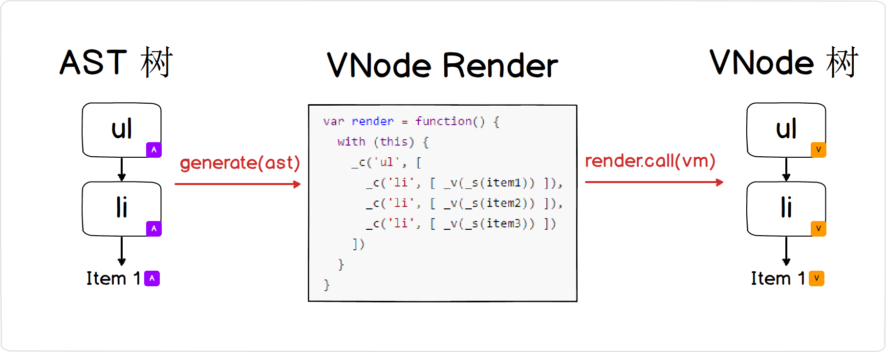
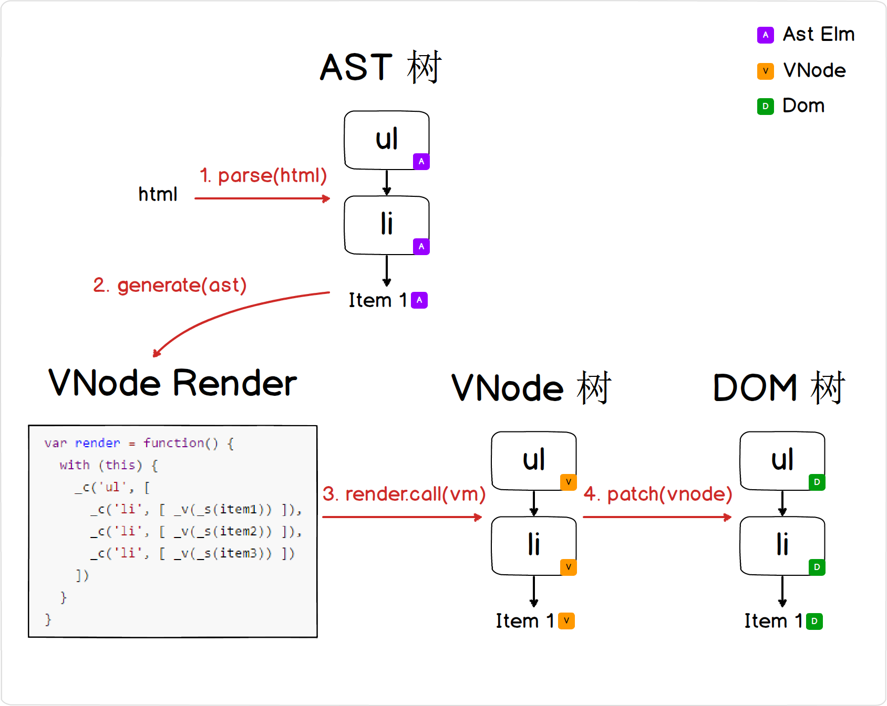

# 1.3 构建一个最简单的数据绑定的Vue

## 前言

前边2节的代码已经让我们有足够的基础可以构造一个简单的 Vue 类。

之前的样例代码：

```javascript
var compile = function(html){
  return generate(parse(html))
}

var container = document.getElementById("example")
var oldVnode = container

var render = function(newVnode){
  patch(oldVnode, newVnode)
  oldVnode = newVnode
}

render(
  compile(
  `<ul>
    <li>Item 1</li>
    <li>Item 2</li>
    <li>Item 3</li>
  </ul>`
  )
)
```

我们更希望下边这样通过 Vue 的对象 ViewModel (之后简称 vm) 来编写代码：

```javascript
var vm = new Vue({
  data: {
    "item1": 'Item 1',
    "item2": 'Item 2',
    "item3": 'Item 3'
  },
  template:
    `<ul>
      <li>{{item1}}</li>
      <li>{{item2}}</li>
      <li>{{item3}}</li>
    </ul>`
})

vm.$mount("example")
```

把数据、操作都可以包装在 Vue 类里边，这种面向对象的抽象使得我们程序的灵活性、可读性、扩展性更佳。

在上边的例子中，我们通过把 vm 里边的数据 data 通过模板语法 {{ }} 绑定在一起，然后渲染到最终 DOM 的文本节点里边 ([参考官方文档](https://cn.vuejs.org/v2/guide/syntax.html#文本))。

但是第一步，我们需要在生成 VNode 树的时候，里边的数据绑定的上下文要绑定在当前 vm 上。

## 1. 在生成 VNode 树时上下文绑定当前 vm

之前，我们生成 VNode 树是这样的：

```javascript
// _c 用来创建非文本节点; _v 用来创建文本节点
_c('ul', [
  _c('li', [ _v("Item 1") ]),
  _c('li', [ _v("Item 2") ]),
  _c('li', [ _v("Item 3") ])
])
```

现在加入了表达式之后，我们可以稍微改造一下，

```javascript
// _c 用来创建非文本节点; _v 用来创建文本节点; _s 用来把变量转成String
_c('ul', [
  _c('li', [ _v(_s(item1)) ]),
  _c('li', [ _v(_s(item2)) ]),
  _c('li', [ _v(_s(item3)) ])
])
```

现在遗留的问题是，我们怎么把这里的 item1, item2, item3 绑定在当前 vm 对象上，大概有以下两种做法。

1. 把所有表达式都编译一个 this 指针，把所有表达式在 AST 树生成的时候都挂在 this 下边：

   ```javascript
   // 生成一个 render
   var render = function() {
     _c('ul', [
       _c('li', [ _v(_s(this.item1)) ]),
       _c('li', [ _v(_s(this.item2)) ]),
       _c('li', [ _v(_s(this.item3)) ])
     ])
   }

   render.call(vm) // 运行时动态绑定上下文
   ```

2. 把 render 放在 with 作用域下：

   ```javascript
   // 生成一个 render
   var render = function() {
     with (this) {
       _c('ul', [
         _c('li', [ _v(_s(item1)) ]),
         _c('li', [ _v(_s(item2)) ]),
         _c('li', [ _v(_s(item3)) ])
       ])
     }
   }

   render.call(vm) // 运行时动态绑定上下文
   ```

相比之下，在编译阶段，方法一需要做更多的工作(要在每个变量前边生成 this.)，而且静态解析的时候很难处理里边的局部变量(运行时才知道作用域)。方法二虽然用 with 污染了render里边的作用域，但是编译阶段就简单很多了，而且 render 本身是动态编译出来的，即便里边作用域被污染，也对外层产生不了多大影响，开发者无需理解内部状态。

Vue 从静态的 AST 树生成动态的 VNode 树时，中间就是通过一个这样的 render 来完成。



所以我们要重新修改一下之前的生成 VNode 树的流程：

```javascript
// compiler/codegen/index.js
export function generate (ast) {
  const code = ast ? genElement(ast) : '_c("div")'

  return {
    render: ("with(this){return " + code + "}")
  }
}

function genElement (el){
  let code
  const children = genChildren(el)
  code = `_c('${el.tag}'${
    children ? `,${children}` : '' // children
  })`

  return code
}

function genChildren (el) {
  const children = el.children
  if (children.length) {
    return `[${children.map(genNode).join(',')}]`
  }
}

function genNode (node) {
  if (node.type === 1) {
    return genElement(node)
  } else {
    return genText(node)
  }
}

function genText (text) {
  return JSON.stringify(text.text)
}
```

通过 ```generate``` 生成 code 函数体之后，我们要动态生成一个 function render 供运行时调用。

```javascript
// compiler/index.js
function makeFunction (code, errors) {
  return new Function(code)
}

export default function compile (template) {
  const ast = parse(template.trim())
  const code = generate(ast)
  return {
    ast,
    render: makeFunction(code.render)
  }
}
```

新的```compile```函数就会生成一个动态运行的 render 函数，后续只需要在渲染 VNode 树阶段，render.call(vm) 即可。

上边提到的 render 函数体，对于理解后续 Vue 各种语法解析有很关键的作用，因此我们需要对这部分剥离一个文档。我们暂且称为 VNode render code，具体文档点击查看 [VNode render code](./VNodeRenderCode.md)。

我们后续把 _c, _v, _s 等生成 VNode 对象的函数称为 renderHelpersFunc。

## 2. 文本节点的数据绑定

还遗留一个问题就是：我们还没有把文本节点的数据绑定表达式解析出来。

```<li>{{item1}}</li>```其中的 item1 需要解析成 ```_s(item1)```，我们需要做以下三步：

1. 改造 AST 树的生成过程，把 {{ }} 解析出来;
2. 改造 generate 生成 renderCode 的过程;
3. 提供动态运行的 _c, _v, _s 函数;

### 2.1 AST 树解析文本节点的 {{ }}

在处理 CharsToken 节点的时候，先用 ```parseText``` 尝试从文本中 parse 出表达式。

对于``` "abc{{a}}xxx{{b}}def"``` 解析出来的表达式是 ```"abc" + _s(a) + "xx" + _s(b) + "def"```

```javascript
// compiler/parser/index.js
export function parse (template) {
  // blabla...
  parseHTML(template, {
    warn,
    start (tag, attrs, unary) { /* blabla.. */ },
    end () { /* blabla.. */ }
    chars () { 
      // blabla..
      // 处理文本节点的表达式
      if (text) {
          let expression
          if (text !== ' ' && (expression = parseText(text))) { 
            // type = 2 表达式节点
            children.push({
              type: 2,
              expression,
              text
            })
          } else { 
            // type = 3 文本节点
            children.push({
              type: 3,
              text
            })
          }
        }
    }
  }
}

// compiler/parser/text-parser.js
const defaultTagRE = /\{\{((?:.|\n)+?)\}\}/g

// 如果输入参数是：text = "abc{{a}}xxx{{b}}def"  
// 产生的 tokens = ["abc", _s(a)", "xx", "_s(b)", "def"]
export function parseText (text) { 
  const tagRE = defaultTagRE
  if (!tagRE.test(text)) {
    return
  }
  const tokens = []
  let lastIndex = tagRE.lastIndex = 0
  let match, index
  while ((match = tagRE.exec(text))) {
    index = match.index
    // 对应以上案例：push("abc")  push("xxx")
    if (index > lastIndex) {
      tokens.push(JSON.stringify(text.slice(lastIndex, index)))
    }
    // 对应以上案例：push("_s(a)")  push("_s(b)")
    const exp = match[1].trim()
    tokens.push(`_s(${exp})`)
    lastIndex = index + match[0].length
  }
  if (lastIndex < text.length) { 
    // 对应以上案例：push("def")
    tokens.push(JSON.stringify(text.slice(lastIndex)))
  }
  return tokens.join('+')
}
```

### 2.2 生成 renderCode 的过程

对于这个语法糖来说，比较简单，我们只需要在生成文本节点的时候区分对待一下表达式文本节点和纯文本即可：

```javascript
// compiler/codegen/index.js
function genText (text) {
  return `_v(${text.type === 2
    ? text.expression
    : JSON.stringify(text.text)
  })`
}
```

### 2.3 提供 renderHelpersFunc函数: _c(), _v() 和 _s()

用于 render 函数的上下文是当前 Vue 对象，因此 _c, _v, _s 等 renderHelpersFunc 挂在 Vue 成员方法最合理了。

PS: 为什么这里要采用下划线开头做命名，这是为了区分开 **公有方法** ( Vue 用 "\$" 开头的方法) 和 **私有方法** (  Vue 用 "_" 开头的方法 )。

```javascript
Vue.prototype._c = createElementVNode
Vue.prototype._v = createTextVNode
Vue.prototype._s = _toString

function createElementVNode(tag, children) {
  let vnode = new VNode(tag, children, undefined, undefined)
  return vnode
}

function createTextVNode (val) {
  return new VNode(undefined, undefined, String(val))
}

function _toString (val) {
  return val == null
    ? ''
    : typeof val === 'object'
      ? JSON.stringify(val, null, 2)
      : String(val)
}
```

### 新增语法糖的流程

总结一下，给Vue 新增一种语法糖的流程如下：



这个流程图非常重要，后续大量篇幅都会用到这个流程，只要弄懂这个过程，自己就可以在 Vue 现有的语法下设计属于一些自己的语法糖。

## 3. 构造 Vue 类

构造 Vue 类难度并不大，我们把传入的 data 对象的所有 key-value 都 set 进当前的 vm 即可。

```javascript
// core/instance/index.js
export default function Vue (options) {
  this.$options = options
  this._init(options)
}

Vue.prototype._initData = function (data) {
  const vm = this
  for (let key in data) { vm[key] = data[key] }
}

Vue.prototype._c = createElementVNode
Vue.prototype._v = createTextVNode
Vue.prototype._s = _toString
```

我们再提供一个  ```$mount``` 方法用来把当前 vm 对象渲染到对应的 parentElm 上，同时提供一个简单的 ```setData``` 方法来修改 vm 的值方便我们测试数据绑定的流程。

```javascript
// core/instance/index.js

Vue.prototype._update = function () {
  const vm = this
  
  // 调用 render 函数得到 VNode 树
  const vnode = vm._render()
  const prevVnode = vm._vnode

  // _vnode 为上一次的 VNode 树
  vm._vnode = vnode
  
  // patch前后两个VNode，渲染到 Dom 树
  patch(prevVnode, vnode)
}

Vue.prototype.setData = function (data) {
  this._initData(data)
  this._update()
}

Vue.prototype.$mount = function (el) {
  vm._vnode = document.getElementById(el)
  this._update()
}
```

## 代码整理

在这一个分支里边，我们在很多地方加了 ```warn``` 提示，当然这个可以更好给使用者清晰的提示，让他们知道哪里使用不当。

例如在解析 HTML 的时候，遇到一个没闭合的标签：

```javascript
// compiler/parser/html-parser.js
function parseEndTag (tagName, start, end) {
  // blabla...
  if (pos >= 0) {
    for (let i = stack.length - 1; i >= pos; i--) {
      if ((i > pos || !tagName) && options.warn) {
        // 存在没闭合标签，给出warn
        options.warn(
          `tag <${stack[i].tag}> has no matching end tag.`
        )
      }
    }
  }
  // blabla...
}
```

当前分支我们新增了 src/core/instance 目录，用来定义 Vue 类及其相关方法。

## 后续

第一部分的介绍基本结束了，最核心和最基础的概念搞懂之后，第二部分的文章就会介绍如何在 Vue 加入更多的语法糖  (属性绑定表达式; 数据订阅; 模板控制语法; 事件处理)。