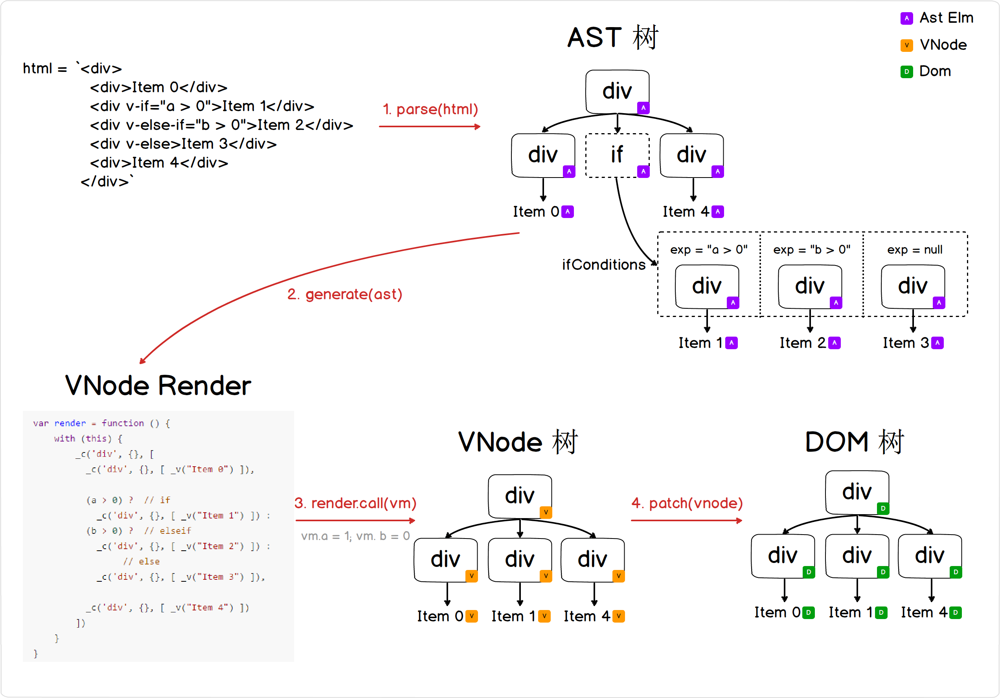

# 2.2.1 条件渲染 v-if, v-else-if, v-else

## 前言

[1.3 节](./1.3.md)说过新增语法糖的四个步骤：


下边我们用这个输入来描述各个阶段产生的数据结构内容：

```html
<div>
  <div>Item 0</div>
  <div v-if="a > 0">Item 1</div>
  <div v-else-if="b > 0">Item 2</div>
  <div v-else>Item 3</div>
  <div>Item 4</div>
</div>
```

整体流程示意图(右键新标签页打开大图更清晰):



##1. AST节点附带 if 信息

这里留意，html 描述上的 v-if, v-else-if, v-else 的三个节点，会被合并到一个 AST 节点，这个 AST 节点上边附带了3个条件信息：

```javascript
ifAstElm.ifConditions = [
  {exp: 'a > 0', block: item1AstEl },
  {exp: 'b > 0', block: item2AstEl },
  {exp: null,    block: item3AstEl },
]
```

```parser```的源码如下：

```javascript
// compiler/parser/index.js
export function parse (template) {
  // blabla...
  parseHTML(template, {
    warn,
    start (tag, attrs, unary) {
      // blabla..

      // 处理 if 等节点，附带 if elseif else 条件信息
      processIf(element)
      processAttrs(element)

      // blabla..

      if (currentParent) {
        if (element.elseif || element.else) { // 处理 else-if else
          processIfConditions(element, currentParent) // 把当前 elseif else节点合并到 if节点
        } else {
          // 原来的逻辑
          currentParent.children.push(element)
          element.parent = currentParent
        }
      }

      // blabla..
    },
    end () {},
    chars (text) {},
  }
  return root
}

function processIf (el) {
  const exp = getAndRemoveAttr(el, 'v-if')
  if (exp) {
    el.if = exp
    addIfCondition(el, {
      exp: exp,
      block: el
    })
  } else {
    if (getAndRemoveAttr(el, 'v-else') != null) {
      el.else = true
    }
    const elseif = getAndRemoveAttr(el, 'v-else-if')
    if (elseif) {
      el.elseif = elseif
    }
  }
}

// v-else-if v-else要找到上一个if节点
function processIfConditions (el, parent) {
  const prev = findPrevElement(parent.children)
  if (prev && prev.if) { //上个节点是if节点，把表达式插入到该节点的 ifCondition 队列去
    addIfCondition(prev, {
      exp: el.elseif,
      block: el
    })
  } else { // 找不到上一个if节点，需要报错
    warn(
      `v-${el.elseif ? ('else-if="' + el.elseif + '"') : 'else'} ` +
      `used on element <${el.tag}> without corresponding v-if.`
    )
  }
}
```

## 2. 生成 VNode render时处理 ifAstElment 节点

```html
<div>
  <div>Item 0</div>
  <div v-if="a > 0">Item 1</div>
  <div v-else-if="b > 0">Item 2</div>
  <div v-else>Item 3</div>
  <div>Item 4</div>
</div>
```

对应生成的 renderCode 如下:

```javascript
var render = function () {
    with (this) {
        _c('div', {}, [
          _c('div', {}, [ _v("Item 0") ]),

          (a > 0) ?  // if
            _c('div', {}, [ _v("Item 1") ]) :
          (b > 0) ?  // elseif
            _c('div', {}, [ _v("Item 2") ]) :
                 // else
            _c('div', {}, [ _v("Item 3") ]),

          _c('div', {}, [ _v("Item 4") ])
        ])
    }
}
```


```javascript
_c('div', {}, [ /* 留意children数组只有3个元素 */
  _c('div', {}, [ _v("Item 0") ]),

  /* 下边这个表达式只会产生一个 VNode 节点 */
  (a > 0) ?  // if
    _c('div', {}, [ _v("Item 1") ]) :
  (b > 0) ?  // elseif
    _c('div', {}, [ _v("Item 2") ]) :
         // else
    _c('div', {}, [ _v("Item 3") ]),
  /* 上边这个表达式只会产生一个 VNode 节点 */

  _c('div', {}, [ _v("Item 4") ])
])
```

我们把 ifAstElm 里边的条件控制语句变成连续的三元运算操作，运算结果产生一个VNode。也就是中间 v-if, v-else-if, v-else 的结构只会产生一个VNode节点，从而达到我们的目的。

那么 ```generate (ast)``` 在处理 ifAstElm 节点的时候变成一系列的三元运算即可:

```javascript
// compiler/codegen/index.js
function genElement (el){
  if (el.if && !el.ifProcessed) {
    return genIf(el)
  } else {
    // 之前逻辑
    // blabla...
  }
}

function genIf (el) {
  el.ifProcessed = true // 标记已经处理过当前这个if节点了，避免递归死循环
  return genIfConditions(el.ifConditions.slice())
}

function genIfConditions (conditions) {
  if (!conditions.length) { // 如果没有 elseif 或者 else 分支
    return '_e()'
  }

  const condition = conditions.shift()
  // 因为我们并没有去真正删除 el.ifConditions 队列的元素，所以需要有el.ifProcessed = true来结束递归
  if (condition.exp) {
    return `(${condition.exp})?${genTernaryExp(condition.block)}:${genIfConditions(conditions)}`
  } else {
    return `${genTernaryExp(condition.block)}`
  }

  function genTernaryExp (el) {
    return genElement(el)
  }
}
```

## 其他步骤

第三步我们只需要提供一个新的 renderHelperFunc _e() 用于创建一个空的 VNode 节点，在忽略 v-elseif 或者 v-else 的情况下，保证生成的 renderCode 里边的表达式运行正确。

v-if 的语法对 DOM 渲染流程没有任何影响，所以无需处理第四步。