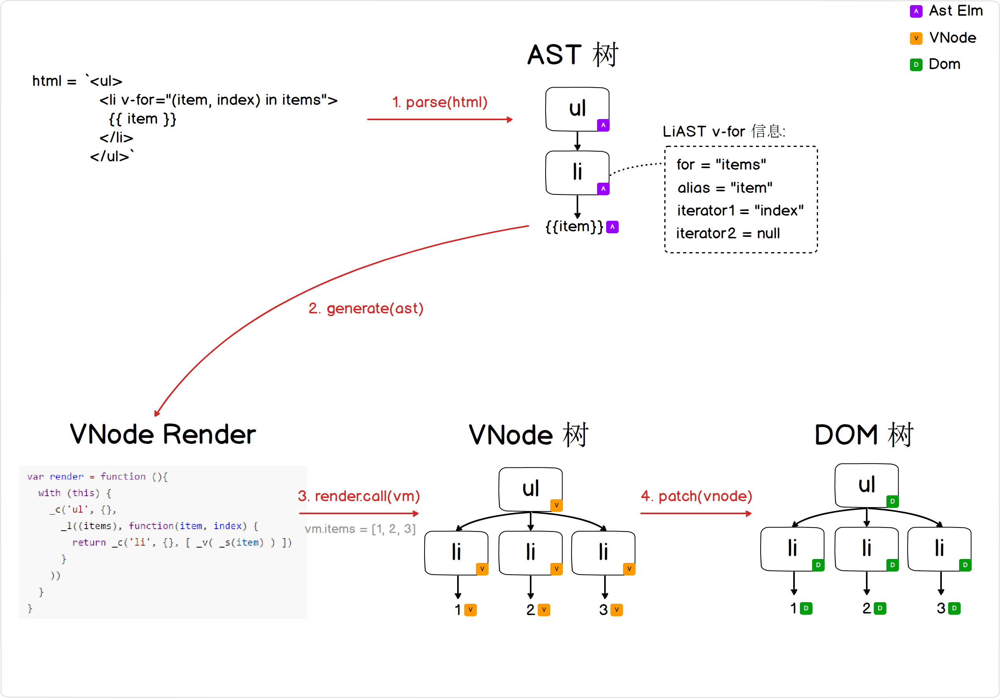

# 2.2.1 列表渲染 v-for

## 前言

[1.3 节](./1.3.md)说过新增语法糖的四个步骤：


在这一节，我们加入 **循环控制** 语法。

输入示例我们用以下字符串:

```html
<ul>
	<li v-for="(item, index) in items">{{ item }}</li>
</ul>
```

整体流程示意图(右键新标签页打开大图更清晰):



## 1. AST节点附带 for 信息

在处理 StartToken 的时候，通过正则把 v-for 的值 parse 出 alias, iterator1, iterator2，代码不复杂:

```javascript
// compiler/parser/index.js
export const forAliasRE = /(.*?)\s+(?:in|of)\s+(.*)/
export const forIteratorRE = /\((\{[^}]*\}|[^,]*),([^,]*)(?:,([^,]*))?\)/

export function parse (template) {
	// blabla...
	parseHTML(template, {
		warn,
		start (tag, attrs, unary) {
			// blabla..

			// 处理 for 节点
			processFor(element)
			processIf(element)
			processAttrs(element)

			// blabla..
		},
		end () {},
		chars (text) {},
	}
	return root
}


function processFor (el) {
	let exp
	if ((exp = getAndRemoveAttr(el, 'v-for'))) {
		const inMatch = exp.match(forAliasRE)
		// v-for="item in list"
		// inMatch = ["item in list", "item", "list"]

		// v-for="(item, index) in list"
		// inMatch = ["(item, index) in list", "(item, index)", "list"]

		// v-for="(value, key, index) in object"
		// inMatch = ["(value, key, index) in object", "(value, key, index)", "object"]

		if (!inMatch) { // v-for语法有错误的时候，提示编译错误
			warn(
				`Invalid v-for expression: ${exp}`
			)
			return
		}
		el.for = inMatch[2].trim()
		const alias = inMatch[1].trim()
		const iteratorMatch = alias.match(forIteratorRE)
		if (iteratorMatch) {
			// v-for="(item, index) in list"  或者 // v-for="(value, key, index) in object"
			el.alias = iteratorMatch[1].trim()
			el.iterator1 = iteratorMatch[2].trim()
			if (iteratorMatch[3]) {
				el.iterator2 = iteratorMatch[3].trim()
			}
		} else {
			// v-for="item in items"
			el.alias = alias // alias = "item"
		}
	}
}
```

## 2. 生成VNode render时处理 AST 节点的 for 信息

根据前边 AST 节点的 for, alias, iterator1, iterator2 信息，生成一个 ```_l()``` 包裹的代码即可:

```javascript
// compiler/codegen/index.js
function genElement (el){
	if (el.for && !el.forProcessed) {
		// 为了 v-for和 v-if 的优先级
		// <ul v-for="(item, index) in list" v-if="index==0">
		// v-if 的语句能引用 v-for 里边声明的变量，所以需要先处理for语句
		return genFor(el)
	} if (el.if && !el.ifProcessed) {
		return genIf(el)
	} else {
		// 之前的逻辑
	}
}


function genFor (el) {
	const exp = el.for
	const alias = el.alias
	const iterator1 = el.iterator1 ? `,${el.iterator1}` : ''
	const iterator2 = el.iterator2 ? `,${el.iterator2}` : ''

	el.forProcessed = true
	return `_l((${exp}),` +
		`function(${alias}${iterator1}${iterator2}){` +
			`return ${genElement(el)}` +
		'})'
}
```

## 3. 提供运行时的 renderHelpersFunc 渲染列表 _l() 函数

刚刚生成的 renderCode 里边出现了一个新的函数 ```_l()```

我们需要依赖 ```_l()``` 在 runtime 阶段渲染出一个 VNode 列表。

```javascript
// core/instance/index.js
Vue.prototype._l = renderList

// core/vdom/vnode.js
export function renderList (val, render) {
	// render = function (alias, iterator1, iterator2) { return VNode }
	let ret, i, l, keys, key
	if (Array.isArray(val) || typeof val === 'string') {
		// v-for="(item, index) in list"
		ret = new Array(val.length)
		for (i = 0, l = val.length; i < l; i++) {
			ret[i] = render(val[i], i)
		}
	} else if (typeof val === 'number') {
		// v-for="n in 10"
		ret = new Array(val)
		for (i = 0; i < val; i++) {
			ret[i] = render(i + 1, i)
		}
	} else if (isObject(val)) {
		// v-for="(item, key) in object"
		// v-for="(value, key, index) in object"
		keys = Object.keys(val)
		ret = new Array(keys.length)
		for (i = 0, l = keys.length; i < l; i++) {
			key = keys[i]
			ret[i] = render(val[key], key, i)
		}
	}
	return ret
}
```

## v-for 复杂的情况

例如以下入示例:

```html
<ul>
	<li>first li</li>
	<li v-for="(item, index) in items">{{ item }}</li>
	<li>last li</li>
</ul>
```

其renderCode 会得到 ```_c('ul', {}, [ _c('li'), _l(xxx), _c('li')])```

其中 ```_l()``` 会返回一个 VNode 列表，相当于 ```_c(tag, data, children)``` 中的 children 实参会收到一个VNode数组嵌套VNode数组的情况。所以我们在 _c 的实现中也要考虑这个情况，把里层嵌套的数组展开:

```javascript
// core/instance/index.js
Vue.prototype._c = createElementVNode

// core/vdom/vnode.js
export function createElementVNode(tag, data, children) {
	if (!tag) {
		return createEmptyVNode()
	}

	return new VNode(tag, data, simpleNormalizeChildren(children), undefined, undefined)
}

// 通过 simpleNormalizeChildren 展开 children 里边的嵌套数组
function simpleNormalizeChildren (children) {
	for (let i = 0; i < children.length; i++) {
		if (Array.isArray(children[i])) {
			return Array.prototype.concat.apply([], children)
		}
	}
	return children
}
```

## 代码整理

这次我们更新了一下 todo 的案例，加入 v-for 的控制语法，[点击查看代码](https://github.com/raphealguo/how-to-learn-vue2/tree/2.2.2/examples/2.2.2/todo)

列表数据在变动时，对应的列表 DOM 树会随着更新。而往往我们更新列表数据只是更新其中某一项，如果整个列表重绘显然效率太低。为了让这里的 DOM 树重绘次数更少，需要引入 key 的概念 ([官方文档](https://cn.vuejs.org/v2/guide/list.html#key))，每个节点都有一个唯一的 key 标记，在 patch 节点 updateChildren 时，复用相同 key 的 DOM 元素。

对这部分感兴趣的见番外篇 [2.2.2.1 列表渲染 v-for 的 key](./2.2.2.1.md)